<a href="url"></a><hr><br>

# Saber Conectar - plataforma virtual  <br> <br>[](https://github.com/PPROF2-2022ProgWeb/g15-aula1-plataforma-virtual-g15/wiki)  [](https://acodemy.000webhostapp.com/) [](https://ideaboardz.com/for/Sprint%201/4547921)

## :construction: Proyecto en construcción :construction:
### Perspectiva del producto:
El sistema _Saber Conectar_ será un producto diseñado para trabajar en entornos web, lo que permitirá su utilización de forma rápida, eficaz y segura, además de integrar datos específicos de las instituciones educativas, como el redireccionamiento a sus páginas webs y redes sociales.

<br>

## Mapa del Sitio 🗺

```mermaid
graph TD;
    INDEX-->LOGIN;
    INDEX-->NOSOTROS;
    INDEX-->INSTITUCIONES;
    INDEX-->ALUMNOS;
    INDEX-->CONTACTO;
    LOGIN-->CARRITO;
    LOGIN-->DASHBOARD_INSTITUCION;
    LOGIN-->DASHBOARD_ALUMNO;
    DASHBOARD_ALUMNO-->CURSOS_ALUMNO-->INSCRIBIRSE;
    DASHBOARD_ALUMNO-->CARRERAS_ALUMNO-->INSCRIBIRSE;
    DASHBOARD_INSTITUCION-->CURSOS;
    CURSOS-->CREAR;
    CURSOS-->MODIFICAR;
    DASHBOARD_INSTITUCION-->CARRERAS;
    CARRERAS-->CREAR;
    CARRERAS-->MODIFICAR;
    INSTITUCIONES-->REGISTRO_INSTITUCIONES;
    ALUMNOS-->REGISTRO_ALUMNOS;
    REGISTRO_ALUMNOS-->RECUPERAR_CONTRASEÑA;
    REGISTRO_INSTITUCIONES-->RECUPERAR_CONTRASEÑA;
    CONTACTO-->FORMULARIO_DE_CONTACTO;
```



<br>

## Recursos Utilizados 📚

       

<br>

## Trabajando con el repositorio 🛠

<details><summary>Si aún no tenemos el repo clonado</summary>

<p>

#### Comencemos clonando el repo en nuestra carpeta local!

```
   git clone https://github.com/PPROF2-2022ProgWeb/g15-aula1-plataforma-virtual-g15.git
```
  
#### Nos movemos a nuestra rama

```
   git checkout jLopez
```
  
#### Luego de realizar los cambios necesarios, agregamos los archivos

```
   git add .
```  
  
#### Los enviamos

```
   git commit -m "mensaje random"
```
    
#### pusheamos y actualizamos nuestra rama de trabajo remota

```
   git push
```
</p>

</details>
<details><summary>Ya tengo el repo!</summary>

<p>
  
#### Nos aseguramos de estar en nuestra rama
```
   git checkout jLopez
```
  
#### Si no modificamos ningun archivo, actualizamos nuestro repo con el repo más actualizado ( ej "JenniferFarias" )

```
   git pull JenniferFarias
```  
  
#### trabajamos y agregamos nuestros archivos modificados

```
   git add .
```
  
#### trabajamos y agregamos nuestros archivos modificados

```
   git commit -m "mensaje random"
```
    
#### pusheamos y actualizamos nuestra rama de trabajo remota

```
   git push
```
</p>

</details>
<details><summary>Quiero Mergear una rama</summary>

<p>
  
#### Nos ubicamos en la rama que quiero mergear ( por ejemplo rama "main")
```
   git checkout main
```
  
#### Mergeamos con nuestra rama

```
   git merge jLopez
```
    
#### pusheamos y actualizamos nuestra rama de trabajo remota

```
   git push
```
</p>

</details>
<details><summary>Correr la aplicación</summary>

<p>

#### Luego de descargar el repo, ejecutar una nueva terminal en el editor de código sobre la carpeta de trabajo
#### Ingresar a la carpeta de la aplicación, en nuestro caso: /app
  
```
   cd app
```
  
#### ejecutar el servidor
  
```
   ng serve -o
```

 #### Para cortar la ejecución, presionar CTRL + C.
</details>

